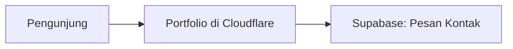

# AGENTS.md — Aturan Otomatis Repo Materi

> File ini adalah instruksi untuk semua AI agent yang bekerja di repo ini.
> User hanya membuat folder topik baru (misal `Blog/`, `TodoApp/`). Agent WAJIB langsung mengisinya dengan materi markdown tanpa menunggu perintah rinci.

## 1. Tujuan Repo

Repo ini adalah **repo materi belajar** untuk orang dengan **minimal knowledge tentang development**.

Tujuan tiap folder topik:

1. Menjelaskan **arti istilah-istilah teknis** software engineer dengan bahasa sederhana.
2. Mengajarkan **cara prompting yang baik** agar bisa membangun dengan AI.
3. Memberi **penjelasan teknikal + contoh TypeScript** yang bisa langsung dibayangkan.
4. Semua materi berupa **Markdown + diagram Mermaid**.

## 2. Aturan Bahasa & Teknologi (Wajib)

- **Bahasa contoh kode: TypeScript saja.** Jangan pakai Python, PHP, Go, atau lainnya kecuali untuk perbandingan 1 blok kecil.
- **Arsitektur default: Cloudflare + Supabase free tier.**
  - Frontend statis → Cloudflare Pages / Workers.
  - Database + Auth + Storage → Supabase (Postgres).
  - Jangan menyarankan VPS berbayar / Docker kompleks / Kubernetes kecuali sebagai catatan "nanti kalau scale".
- **Bahasa penjelasan: Bahasa Indonesia santai tapi jelas.** Istilah teknis tetap Bahasa Inggris (misal `Database`, bukan `Basis Data`), lalu dijelaskan artinya.

## 3. Aturan Auto-Isi Folder (Paling Penting)

Saat user membuat folder baru yang masih kosong (hanya ada nama folder, misal `Portfolio/`):

1. **Jangan bertanya. Langsung isi.**
2. Buat struktur ini di dalam folder tersebut:

```text
TopikBaru/
  README.md                        ← pintu masuk, daftar isi, peta belajar, estimasi waktu
  00-apa-itu-<topik>.md            ← konsep paling dasar, analogi sehari-hari
  01-anatomi-<topik>.md            ← bagian-bagian pembentuknya + diagram
  02-istilah-teknis-<topik>.md     ← daftar istilah + link ke Glossary
  03-arsitektur-<topik>.md         ← arsitektur Cloudflare/Supabase free tier + diagram
  04-cara-prompting-<topik>.md     ← rumus prompt + contoh jelek vs bagus
  05-latihan-<topik>.md            ← tugas praktik bertahap
  06-checklist-<topik>.md          ← checklist "siap online"
```

3. Jumlah file boleh 5–7, sesuaikan dengan kompleksitas topik. Nama file selalu `nomor-nama-bahasa-indonesia.md` huruf kecil dengan strip.
4. `README.md` tiap topik WAJIB berisi: apa yang dipelajari, prasyarat (biasanya "tidak ada"), estimasi waktu, daftar modul berurutan, dan cara pakai bersama AI.

## 4. Aturan Glossary (Wajib Link)

- Setiap istilah teknis yang muncul di materi **WAJIB di-link ke Glossary** pada kemunculan pertamanya per file.
- Format link relatif:

```markdown
[Database](../Glossary/database.md)
[API](../Glossary/api.md)
[Frontend](../Glossary/frontend.md)
```

- Aturan file Glossary: **satu istilah = satu file**, nama file huruf kecil dengan strip, misal:
  - `Glossary/database.md`
  - `Glossary/api.md`
  - `Glossary/cloudflare.md`
- Jika istilah yang dibutuhkan belum ada di `Glossary/`, **buatkan file barunya** dengan template di bawah. Jangan biarkan link mati.
- Template tiap file Glossary:

```markdown
# Istilah

> Satu kalimat sederhana: istilah ini tuh apa.

## Analogi Sehari-hari

...

## Penjelasan Teknikal

...

## Contoh TypeScript (kalau relevan)

```ts
// contoh minimal
```

## Kapan Kamu Ketemu Istilah Ini?

...

## Istilah Terkait

- [Istilah Lain](./istilah-lain.md)
```

## 5. Aturan Mermaid (Wajib Banyak)

- Setiap modul (kecuali checklist) WAJIB punya **minimal 1 diagram Mermaid**.
- Pilih jenis yang paling gampang dibayangkan:
  - `flowchart LR/TD` → untuk alur / arsitektur.
  - `sequenceDiagram` → untuk interaksi (browser → server → database).
  - `erDiagram` → untuk struktur data.
  - `graph` sederhana → untuk anatomi halaman.
- Setiap diagram WAJIB diberi 1 paragraf penjelasan "cara baca diagramnya" tepat di bawahnya.
- Jangan pakai gambar eksternal. Semua visual harus Mermaid agar bisa render di GitHub.

Contoh pola yang bagus:

````markdown

````

## 6. Aturan Gaya Penjelasan

Target pembaca: **belum tahu apa-apa**. Maka:

1. Mulai dari analogi dunia nyata, baru masuk teknikal.
2. Satu istilah asing → langsung jelaskan + link Glossary di kalimat yang sama.
3. Setiap konsep abstrak → kasih contoh konkret TypeScript atau contoh tampilan.
4. Akhiri tiap modul dengan 3 bagian ini:

```markdown
## Coba Pikirkan
...

## Prompt yang Bisa Kamu Coba
...

## Lanjut ke ...
```

## 7. Aturan Prompting (Setiap Topik Wajib Ada)

Setiap topik wajib punya file `04-cara-prompting-*` berisi:

- Rumus dasar: **Konteks + Tujuan + Batasan + Contoh + Format Output**.
- Minimal 3 pasang contoh **Prompt Jelek vs Prompt Bagus**.
- Minimal 5 prompt siap copy-paste yang spesifik untuk topik itu.
- Jelaskan kenapa prompt bagus bekerja (bukan sekadar "ini lebih detail").

## 8. Yang Tidak Boleh

- Jangan membuat materi yang butuh server berbayar untuk dipraktikkan.
- Jangan memakai bahasa selain TypeScript untuk contoh utama.
- Jangan membuat link Glossary absolut (`C:/...`) — selalu relatif (`../Glossary/...`).
- Jangan membuat file kosong / placeholder "segera hadir".
- Jangan mengubah file di topik lain tanpa alasan.

## 9. Cek Sendiri Sebelum Selesai

Sebelum bilang selesai, pastikan:

- [ ] Semua link `../Glossary/*.md` benar-benar ada filenya.
- [ ] Semua blok ` ```mermaid ` tertutup dengan benar.
- [ ] Tidak ada contoh kode selain TypeScript (kecuali SQL kecil untuk Supabase).
- [ ] `README.md` topik menautkan semua modul secara berurutan.
- [ ] `Glossary/README.md` (indeks) sudah ditambah istilah baru jika ada.
