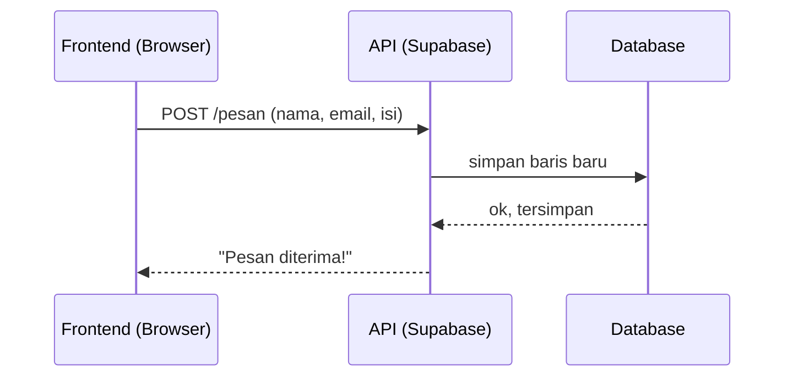

# API

> Satu kalimat sederhana: API itu **pelayan restoran** yang menyampaikan pesanan antara meja dan dapur.

## Analogi Sehari-hari

Kamu (pengunjung = [Frontend](./frontend.md)) tidak masuk dapur ([Backend](./backend.md)). Kamu panggil pelayan (API): "Satu pesan kontak, tolong simpan." Pelayan mengantar ke dapur, lalu kembali membawa jawaban: "Siap, sudah disimpan."

## Penjelasan Teknikal

API adalah **aturan cara meminta sesuatu**. Bentuk paling umum: alamat URL + metode (`GET` = ambil, `POST` = kirim/simpan). Contoh:

- `GET /proyek` → "tolong ambilkan daftar proyek."
- `POST /pesan` → "tolong simpan pesan ini."

Supabase membuatkan API otomatis dari tabel [Database](./database.md)-mu, jadi frontend bisa simpan/baca data tanpa bikin server sendiri.



Cara baca diagramnya: waktu berjalan dari atas ke bawah. Panah ke kanan = permintaan, panah putus-putus ke kiri = jawaban.

## Contoh TypeScript (kalau relevan)

```ts
// Memanggil API Supabase = memesan ke pelayan
await supabase.from("pesan").insert({ nama: "Sinta", isi: "Halo!" });
```

## Kapan Kamu Ketemu Istilah Ini?

Setiap frontend perlu data dari luar dirinya: daftar proyek, kirim form, login.

## Istilah Terkait

- [Frontend](./frontend.md)
- [Backend](./backend.md)
- [Supabase](./supabase.md)
