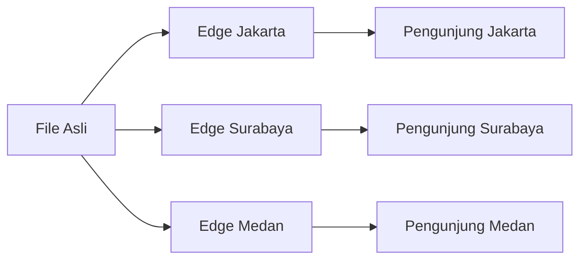

# CDN

> Satu kalimat sederhana: CDN itu **cabang fotokopian di banyak kota** — pengunjung dilayani dari cabang terdekat.

## Analogi Sehari-hari

Satu toko fotokopi di Jakarta melayani pembeli dari Papua = lambat. CDN membuka "cabang salinan" di ratusan kota. File portfoliomu disalin ke semua cabang; pengunjung otomatis dilayani cabang terdekat, jadi loading cepat di mana pun.

## Penjelasan Teknikal

CDN (Content Delivery Network) menyimpan salinan (cache) file statis di server edge seluruh dunia. Cloudflare adalah salah satu CDN terbesar — portfoliomu di Pages otomatis disebar via CDN tanpa setting.

Cara baca diagramnya: file asli di kiri disalin ke tiga edge. Tiap pengunjung dilayani edge kotanya, bukan file asli — makanya cepat.

## Kapan Kamu Ketemu Istilah Ini?

Saat orang bilang "website-mu cepat diakses dari mana saja" — itu kerja CDN.

## Istilah Terkait

- [Cloudflare](./cloudflare.md)
- [Hosting](./hosting.md)
- [Static Site](./static-site.md)
