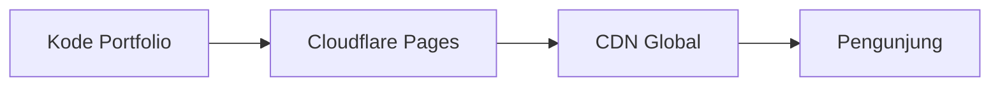

# Cloudflare

> Satu kalimat sederhana: Cloudflare itu **tuan tanah + satpam gratis** untuk websitemu.

## Analogi Sehari-hari

Kamu mau buka warung (portfolio). Cloudflare kasih: tanah gratis ([Hosting](./hosting.md) Pages), alamat gratis (`*.pages.dev` = [Domain](./domain.md)), satpam ([HTTPS](./https.md) + anti serangan), dan cabang di mana-mana ([CDN](./cdn.md)). Semua free tier-nya cukup untuk portfolio.

## Penjelasan Teknikal

Produk yang dipakai di repo ini:

- **Pages** — hosting [Static Site](./static-site.md). Push ke [Git](./git) → otomatis [Deploy](./deploy.md).
- **Workers** (opsional, nanti) — fungsi kecil di edge untuk logika ringan.
- **DNS + SSL otomatis** — domain langsung aman (gembok hijau).



Cara baca diagramnya: kirim kode sekali ke Pages, Pages menyebar via CDN, pengunjung di mana pun dapat versi cepat.

## Contoh TypeScript (kalau relevan)

Tidak ada kode khusus — Cloudflare dikonfigurasi lewat dashboard / file config kecil. Contoh variabel yang dibaca kode:

```ts
const siteUrl: string = process.env.SITE_URL ?? "https://namamu.pages.dev";
```

## Kapan Kamu Ketemu Istilah Ini?

Setiap modul arsitektur & deploy portfolio di repo ini.

## Istilah Terkait

- [Hosting](./hosting.md)
- [CDN](./cdn.md)
- [Deploy](./deploy.md)
