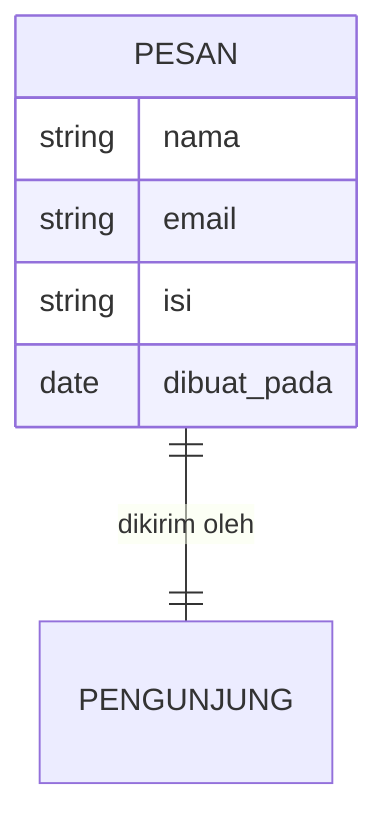

# Database

> Satu kalimat sederhana: Database itu **lemari arsip rapi** tempat aplikasimu menyimpan data.

## Analogi Sehari-hari

Bayangkan lemari arsip dengan banyak laci berlabel: laci "Pesan Kontak", laci "Proyek", laci "Pengguna". Setiap kertas di dalamnya punya format sama (nama, tanggal, isi). Mau cari pesan dari bulan lalu? Tinggal buka laci yang tepat — tidak perlu bongkar semua.

## Penjelasan Teknikal

Database menyimpan data dalam bentuk **tabel** (baris = satu data, kolom = atributnya). Contoh tabel `pesan`:

| nama  | email           | isi            |
| ----- | --------------- | -------------- |
| Sinta | sinta@mail.com  | Halo, kerja?   |

Di repo ini databasenya adalah **Postgres** yang disediakan [Supabase](./supabase.md) — gratis, dan bisa diakses lewat [API](./api.md) otomatis.



Cara baca diagramnya: kotak `PESAN` adalah satu laci arsip. Daftar di dalamnya adalah kolom-kolomnya. Garis ke `PENGUNJUNG` artinya setiap pesan dikirim oleh seseorang.

## Contoh TypeScript (kalau relevan)

```ts
type Pesan = {
  nama: string;
  email: string;
  isi: string;
};
```

## Kapan Kamu Ketemu Istilah Ini?

Setiap ada data yang harus **ingat walau browser ditutup**: pesan kontak, daftar proyek, data login.

## Istilah Terkait

- [DB](./db.md)
- [Backend](./backend.md)
- [Supabase](./supabase.md)
