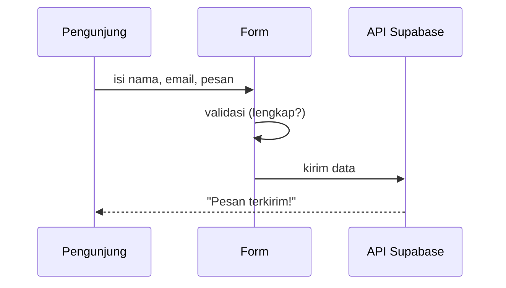

# Form

> Satu kalimat sederhana: Form itu **formulir isian** — kotak nama, email, pesan + tombol kirim.

## Analogi Sehari-hari

Seperti slip setoran di bank: ada kolom yang harus diisi, ada aturan (nomor rekening harus angka), lalu diserahkan ke teller ([API](./api.md)) untuk diproses. Form kontak portfolio = slip "hubungi saya".

## Penjelasan Teknikal

Form punya 3 lapis:

1. **Tampilan** — input + tombol ([Frontend](./frontend.md)).
2. **Validasi** — cek isian (email beneran? pesan tidak kosong?) sebelum dikirim.
3. **Pengiriman** — data dikirim via API ke [Database](./database.md) ([Supabase](./supabase.md)).



Cara baca diagramnya: baca dari atas. Validasi terjadi di browser dulu (cepat, tanpa internet pun bisa), baru data jalan ke server.

## Contoh TypeScript (kalau relevan)

```ts
type FormKontak = {
  nama: string;
  email: string;
  pesan: string;
};

function validasi(f: FormKontak): boolean {
  return f.nama !== "" && f.email.includes("@") && f.pesan.length >= 10;
}
```

## Kapan Kamu Ketemu Istilah Ini?

Form kontak adalah satu-satunya bagian "dinamis" di portfolio statis — modul khusus membahasnya.

## Istilah Terkait

- [API](./api.md)
- [Supabase](./supabase.md)
- [Spam](./spam.md)
