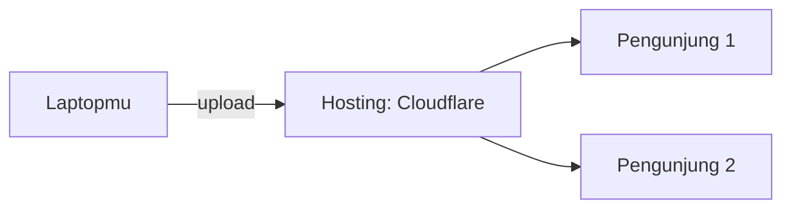

# Hosting

> Satu kalimat sederhana: Hosting itu **lahan tempat websitemu tinggal** agar bisa dikunjungi orang.

## Analogi Sehari-hari

Bikin portfolio seperti bikin rumah contoh. Kalau cuma ada di laptopmu, hanya kamu yang bisa lihat. Hosting = menyewa kavling di kota internet supaya rumahmu punya alamat dan bisa didatangi siapa pun, kapan pun — walau laptopmu mati.

## Penjelasan Teknikal

Komputer server hosting menyimpan file websitemu dan menjawab setiap ada pengunjung. Untuk portfolio statis, [Cloudflare](./cloudflare.md) (Pages) memberi hosting gratis: kamu upload file, mereka yang sebar ke seluruh dunia lewat [CDN](./cdn.md).

Cara baca diagramnya: panah dari laptop ke hosting = kamu menerbitkan sekali. Panah ke pengunjung = mereka semua dilayani hosting, bukan laptopmu.

## Kapan Kamu Ketemu Istilah Ini?

Saat materi bilang "online-kan", "publish", atau "[Deploy](./deploy.md)" — ujungnya selalu butuh hosting.

## Istilah Terkait

- [Cloudflare](./cloudflare.md)
- [Deploy](./deploy.md)
- [Domain](./domain.md)
