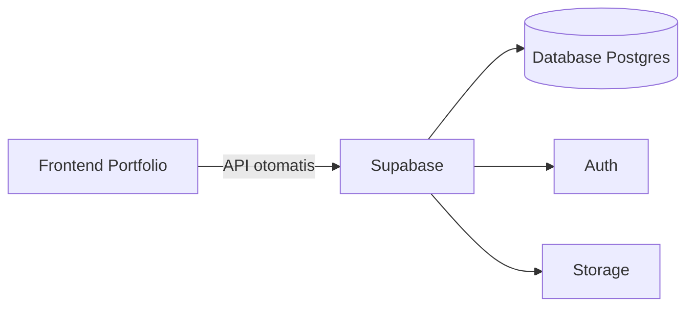

# Supabase

> Satu kalimat sederhana: Supabase itu **[Database](./database.md) + [API](./api.md) + login siap pakai**, gratis untuk mulai.

## Analogi Sehari-hari

Kalau Cloudflare adalah tanah + bangunan warungmu, Supabase adalah **gudang + kasir + buku catatan member** yang sudah jadi. Kamu tidak perlu bangun gudang sendiri — tinggal pakai, lewat pelayan (API otomatis).

## Penjelasan Teknikal

Supabase = Postgres (database) + API otomatis + Auth (login) + Storage (file). Free tier cukup untuk portfolio: simpan pesan [Form](./form.md) kontak, daftar proyek dinamis, dst. Kamu atur tabel lewat dashboard, lalu akses dari [Frontend](./frontend.md) pakai library JS.



Cara baca diagramnya: frontend hanya bicara ke satu kotak Supabase; di dalamnya ada tiga layanan. Kamu pakai yang dibutuhkan saja.

## Contoh TypeScript (kalau relevan)

```ts
import { createClient } from "@supabase/supabase-js";

const supabase = createClient(process.env.SUPABASE_URL!, process.env.SUPABASE_KEY!);

// Ambil daftar proyek untuk portfolio
const { data: proyek } = await supabase.from("proyek").select("*");
```

## Kapan Kamu Ketemu Istilah Ini?

Setiap ada data yang disimpan: form kontak, daftar proyek, testimoni.

## Istilah Terkait

- [Database](./database.md)
- [API](./api.md)
- [Backend](./backend.md)
