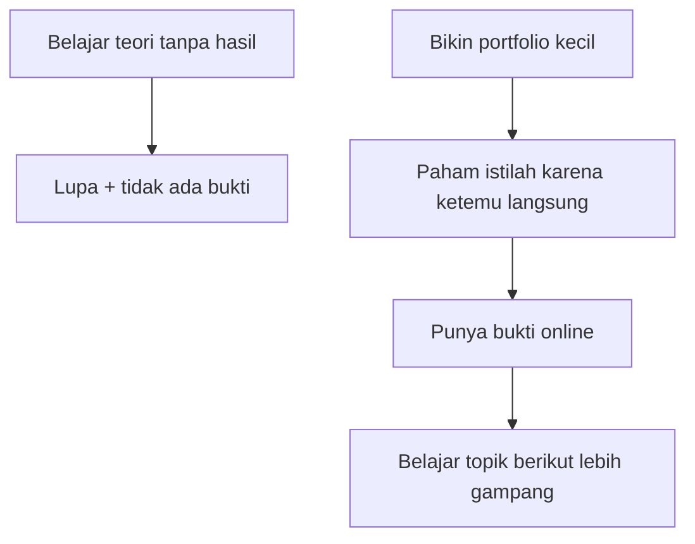

# 00 — Apa itu Portfolio?

> Portfolio itu **rumah contoh**: bukti nyata bahwa kamu bisa membangun, bukan sekadar ngaku bisa.

## Analogi: Tukang vs Makelar

Dua orang melamar jadi tukang furnitur. Yang satu bawa foto lemari hasil karyanya. Yang satu cuma bilang "saya bisa, percaya deh". Kamu sebagai perekrut pilih yang mana? Portfolio = **foto lemari** itu. Bedanya, di dunia web, "fotonya" berupa website yang bisa diklik dan dicoba langsung.

Secara teknis, portfolio adalah [Static Site](../Glossary/static-site.md): halaman [Frontend](../Glossary/frontend.md) yang menampilkan siapa kamu, apa yang bisa kamu buat, dan cara menghubungimu.

## Kenapa Portfolio Dulu, Bukan Belajar Teori Dulu?



Cara baca diagramnya: dua jalur dari atas. Jalur A (kiri) berujung buntu. Jalur C (kanan) berputar naik — tiap langkah menguatkan langkah berikut. Itulah kenapa repo ini mulai dari portfolio.

Alasannya praktis:

1. **Istilah jadi nyata.** Kamu paham [Database](../Glossary/database.md) karena pesannya beneran tersimpan — bukan karena hafal definisi.
2. **Ada bukti.** Link portfolio bisa dikirim ke siapa pun mulai hari ini.
3. **Gratis total.** [Hosting](../Glossary/hosting.md) ([Cloudflare](../Glossary/cloudflare.md)) + database ([Supabase](../Glossary/supabase.md)) free tier cukup.

## Isi Standar Sebuah Portfolio

Cukup 4 ruangan di "rumah contohmu":

1. **Beranda (Hero)** — siapa kamu, dalam 5 detik pengunjung paham.
2. **Proyek** — 2–3 karya (awalnya boleh tugas latihan modul 05!).
3. **Tentang** — cerita singkat + skill.
4. **Kontak** — [Form](../Glossary/form.md) yang pesannya beneran tersimpan.

Detail tiap ruangan dibedah di modul 01. Arsitekturnya di modul 03. Cara menyuruh AI bikinin di modul 04.

## Contoh TypeScript: Data Portfolio Itu Sederhana

Seluruh isi portfolio pada dasarnya cuma data seperti ini:

```ts
type Proyek = {
  judul: string;
  deskripsi: string;
  link?: string;
};

const pemilik: string = "Namamu";
const proyekUnggulan: Proyek[] = [
  { judul: "Portfolio ini", deskripsi: "Website pertamaku yang online." },
  { judul: "Latihan form kontak", deskripsi: "Form yang tersimpan di Supabase." },
];
```

Itu saja. Sisanya (tampilan, hosting, database) adalah "bingkai" di sekitar data ini — dan semua dibahas satu per satu.

## Coba Pikirkan

- Kalau perekrut cuma punya 10 detik di websitemu, kalimat apa yang harus mereka baca pertama?
- Dari 4 ruangan di atas, mana yang paling susah kamu isi hari ini? (Biasanya "Proyek" — dan itu wajar, latihan modul 05 menyelesaikannya.)

## Prompt yang Bisa Kamu Coba

> "Jelaskan apa itu portfolio website untuk orang yang belum pernah ngoding, pakai analogi rumah. Akhiri dengan 4 bagian wajibnya."

## Lanjut ke ...

[01 — Anatomi Portfolio](./01-anatomi-portfolio.md): bedah tiap ruangan rumah contohmu.
