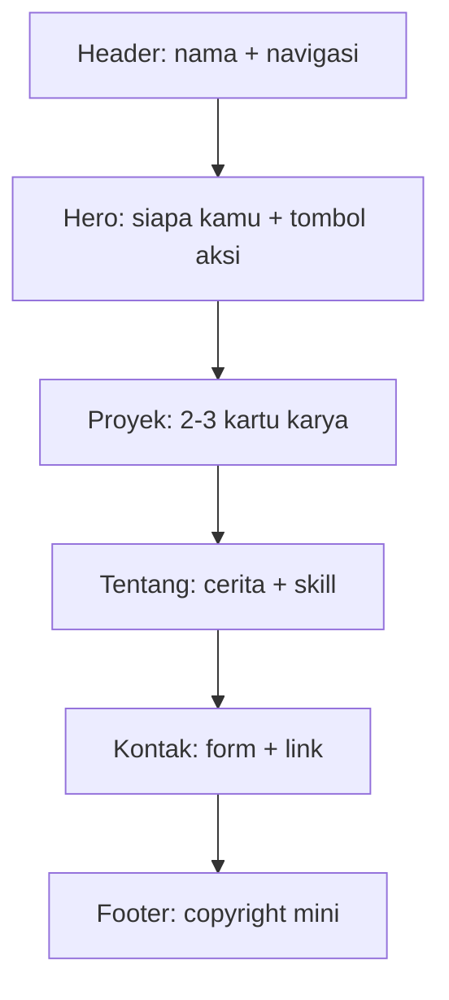
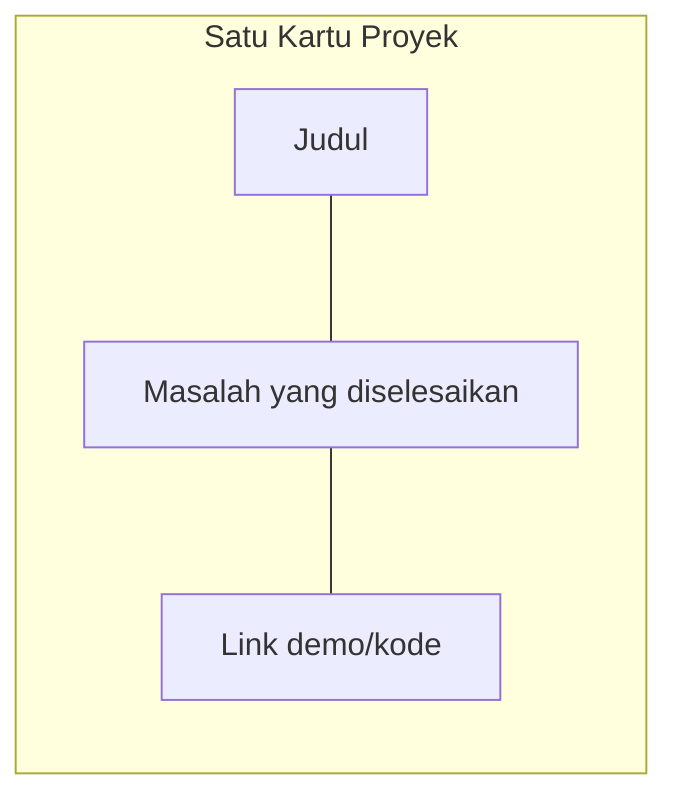

# 01 — Anatomi Portfolio: Bedah Tiap Ruangan

> Satu halaman portfolio terdiri dari potongan-potongan ([Component](../Glossary/component.md)) yang disusun dari atas ke bawah seperti denah rumah.

## Denah Halaman



Cara baca diagramnya: dari atas ke bawah = urutan yang dilihat pengunjung saat scroll. Tiap kotak adalah satu component yang bisa dibuat dan diperbaiki terpisah.

## 1. Header — Papan Nama di Pagar

Isinya: namamu + link lompat (Proyek, Tentang, Kontak). Selalu terlihat walau di-scroll (disebut *sticky*). Tugasnya satu: pengunjung tidak tersesat.

## 2. Hero — Ruang Tamu (5 Detik Penentu)

Bagian paling penting. Dalam 5 detik harus menjawab: **siapa kamu, bisa apa, mau apa**. Rumusnya: 1 kalimat identitas + 1 kalimat bukti + 1 tombol aksi ("Lihat Proyek" / "Hubungi Saya"). Tanpa foto formal pun tidak apa — nama besar + kalimat jelas menang atas desain ramai tapi membingungkan.

## 3. Proyek — Ruang Pamer

2–3 [Component](../Glossary/component.md) kartu, masing-masing: judul, 1–2 kalimat masalah yang diselesaikan, dan link (demo / kode di [Repo](../Glossary/repo.md)). Untuk pemula, isi boleh dari latihan modul 05 — perekrut menilai **cara kamu menjelaskan**, bukan skala proyeknya.



Cara baca diagramnya: tiap kartu punya 3 unsur yang saling terhubung. Kalau salah satunya hilang (misal tanpa link), kartu terasa "buntu".

## 4. Tentang — Ruang Cerita

2–3 paragraf pendek: latar belakangmu, apa yang dipelajari sekarang, apa yang dicari. Plus daftar skill jujur (misal: "TypeScript dasar, Cloudflare Pages, Supabase"). Jangan tulis skill yang tidak bisa kamu jelaskan — akan ditanya saat interview.

## 5. Kontak — Kotak Surat + Teras

[Form](../Glossary/form.md) (nama, email, pesan) + link alternatif (email, GitHub, LinkedIn). Form inilah satu-satunya bagian yang butuh [Backend](../Glossary/backend.md)/[Database](../Glossary/database.md) — dibahas tuntas di modul 03.

## 6. Footer — Keset Kaki

Satu baris: "© 2026 Namamu — dibuat dengan TypeScript". Kecil tapi menandakan selesai dan rapi.

## Contoh TypeScript: Halaman = Susunan Component

```ts
// Bayangkan tiap ruangan adalah fungsi component
type Section = "header" | "hero" | "proyek" | "tentang" | "kontak" | "footer";

const urutanHalaman: Section[] = ["header", "hero", "proyek", "tentang", "kontak", "footer"];

function renderUrutan(urutan: Section[]): string {
  return urutan.map((s) => `<section id="${s}"></section>`).join("\n");
}
```

## Coba Pikirkan

- Buka 2–3 portfolio orang lain. Di hero mereka, apakah kamu paham dalam 5 detik siapa mereka? Apa yang bikin paham / bingung?
- Tulis draf 1 kalimat identitasmu sekarang (jelek tidak apa, modul 04 membantu memolesnya).

## Prompt yang Bisa Kamu Coba

> "Saya mau bikin portfolio satu halaman. Beri saya kerangka 6 bagian (header, hero, proyek, tentang, kontak, footer) dan untuk tiap bagian: tujuannya dalam 1 kalimat + contoh isi untuk pemula yang baru belajar TypeScript."

## Lanjut ke ...

[02 — Istilah Teknis Portfolio](./02-istilah-teknis-portfolio.md): semua kata asing di modul ini dijelaskan + link kamus.
