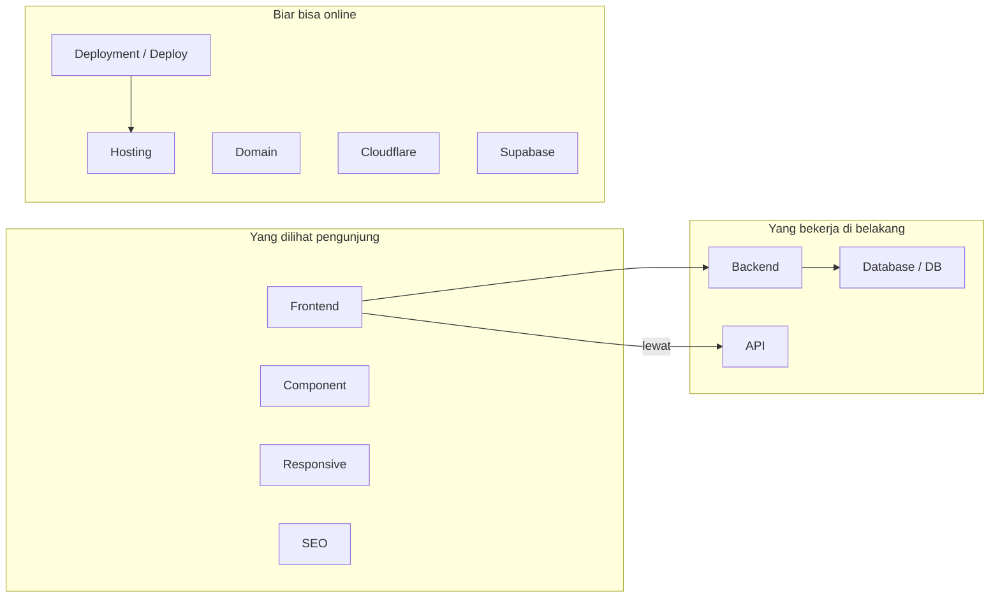

# 02 — Istilah Teknis Portfolio: Kamus Mini

> Semua kata teknis yang kamu temui di portfolio, dijelaskan dengan contoh portfolio-nya langsung. Klik linknya untuk versi kamus lengkap di [Glossary](../Glossary/README.md).

## Peta Istilah



Cara baca diagramnya: tiga kelompok sesuai peran. Panah antar kelompok menunjukkan hubungan ("frontend meminta ke backend", "deployment menuju hosting"). Istilah di dalam satu kelompok sering disebut bersamaan.

## Kelompok 1: Yang Dilihat Pengunjung

| Istilah | Artinya dalam 1 kalimat | Contoh di portfoliomu |
| ------- | ----------------------- | --------------------- |
| [Frontend](../Glossary/frontend.md) | Bagian yang dilihat & diklik | Seluruh halaman portfoliomu |
| [Component](../Glossary/component.md) | Potongan LEGO halaman | Kartu proyek, header, form kontak |
| [Responsive](../Glossary/responsive.md) | Rapi di HP & laptop | Kartu proyek menumpuk 1 kolom di HP |
| [SEO](../Glossary/seo.md) | Biar ditemui Google | Judul tab "Portfolio Namamu — Web Developer" |
| [Form](../Glossary/form.md) | Formulir isian | Kolom nama/email/pesan + tombol kirim |
| [TypeScript](../Glossary/typescript.md) | Bahasa kode repo ini | Semua contoh `const x: string = ...` |

## Kelompok 2: Dapur di Belakang

| Istilah | Artinya dalam 1 kalimat | Contoh di portfoliomu |
| ------- | ----------------------- | --------------------- |
| [Backend](../Glossary/backend.md) | Dapur pengolah data | Supabase yang menyimpan pesan kontak |
| [API](../Glossary/api.md) | Pelayan frontend↔backend | `supabase.from("pesan").insert(...)` |
| [Database](../Glossary/database.md) / [DB](../Glossary/db.md) | Lemari arsip data | Tabel `pesan` berisi semua pesan masuk |
| [Spam](../Glossary/spam.md) | Pesan sampah massal | Bot mengisi form 100x — harus dicegah |
| [HTTPS](../Glossary/https.md) | Gembok pengaman browser | `https://` + ikon gembok di portfoliomu |
| [Environment Variable](../Glossary/environment-variable.md) | Catatan rahasia di server | `SUPABASE_KEY` yang tidak ditulis di kode |

## Kelompok 3: Biar Bisa Online

| Istilah | Artinya dalam 1 kalimat | Contoh di portfoliomu |
| ------- | ----------------------- | --------------------- |
| [Hosting](../Glossary/hosting.md) | Lahan tempat website tinggal | Cloudflare Pages |
| [Cloudflare](../Glossary/cloudflare.md) | Tuan tanah + satpam gratis | Pages + CDN + HTTPS otomatis |
| [Supabase](../Glossary/supabase.md) | Database + API siap pakai | Tabel `pesan` + `proyek` |
| [Domain](../Glossary/domain.md) | Alamat rumah website | `namamu.pages.dev` |
| [DNS](../Glossary/dns.md) | Buku telepon internet | Mengatur otomatis oleh Cloudflare |
| [CDN](../Glossary/cdn.md) | Cabang server di banyak kota | Portfolio cepat dibuka dari mana saja |
| [Static Site](../Glossary/static-site.md) | Website yang sudah jadi duluan | Portfoliomu (cepat + gratis) |
| [Deployment](../Glossary/deployment.md) / [Deploy](../Glossary/deploy.md) | Proses/tindakan menerbitkan | Push ke Git → online otomatis |
| [Git](../Glossary/git.md) | Mesin waktu kode | `commit` tiap selesai satu bagian |
| [Repository](../Glossary/repository.md) / [Repo](../Glossary/repo.md) | Folder proyek tercatat Git | Repo `portfolio` di GitHubmu |
| [Framework](../Glossary/framework.md) | Kerangka setengah jadi | Astro / Next.js untuk membangun halaman |

## Contoh TypeScript: Istilah dalam Satu Alur

```ts
// Satu baris kode, banyak istilah bekerja sama:
// Frontend (form) --API--> Supabase (backend) --> Database (tabel pesan)
import { createClient } from "@supabase/supabase-js";

const supabase = createClient(
  process.env.SUPABASE_URL!, // Environment Variable: alamat Supabase
  process.env.SUPABASE_KEY!  // Environment Variable: kunci rahasia
);

type Pesan = { nama: string; email: string; isi: string }; // TypeScript: label datanya

async function kirimPesan(p: Pesan): Promise<void> {
  await supabase.from("pesan").insert(p); // API: titip ke pelayan, disimpan ke Database
}
```

## Coba Pikirkan

- Tutup halaman ini, lalu jelaskan dengan kata-katamu: apa beda Frontend dan Backend? (Kalau bisa tanpa lihat = paham.)
- Dari tabel di atas, istilah mana yang masih paling kabur? Klik link Glossary-nya dan baca analoginya.

## Prompt yang Bisa Kamu Coba

> "Jelaskan perbedaan frontend, backend, database, dan API memakai contoh form kontak portfolio. Satu analogi restoran, lalu satu contoh TypeScript."

## Lanjut ke ...

[03 — Arsitektur Portfolio](./03-arsitektur-portfolio.md): bagaimana semua istilah ini disambung jadi sistem gratis yang online.
