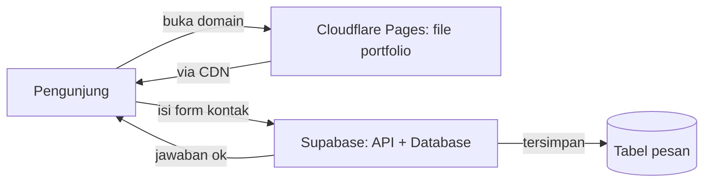
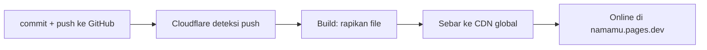
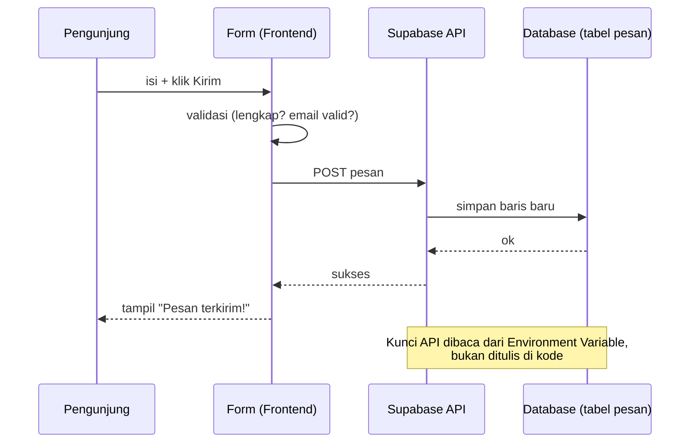
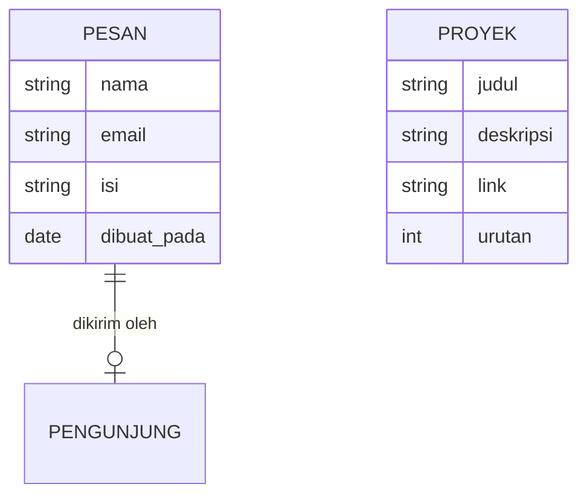

# 03 — Arsitektur Portfolio: Rumah Gratis di Cloudflare + Supabase

> Arsitektur = **denah teknis**: bagian apa bicara ke bagian apa. Portfolio memakai pola paling murah: [Static Site](../Glossary/static-site.md) di [Cloudflare](../Glossary/cloudflare.md) + data di [Supabase](../Glossary/supabase.md).

## Gambaran Besar



Cara baca diagramnya: dua jalur. Jalur atas (Pages → pengunjung) untuk **membaca** portfolio — cepat karena CDN. Jalur bawah (pengunjung → Supabase) hanya terjadi saat **mengirim form** — satu-satunya momen butuh database.

Kenapa begini? Karena 99% aktivitas portfolio adalah *membaca* (lihat-lihat). Membaca tidak butuh dapur menyala — file jadi cukup. Dapur (Supabase) hanya dinyalakan sesaat saat ada yang mengirim pesan. Hasilnya: cepat + gratis.

## Peran Tiap Layanan (Free Tier)

| Layanan | Peran | Yang gratis |
| ------- | ----- | ----------- |
| [Cloudflare Pages](../Glossary/cloudflare.md) | [Hosting](../Glossary/hosting.md) file portfolio + [HTTPS](../Glossary/https.md) + [CDN](../Glossary/cdn.md) | Unlimited site statis, domain `*.pages.dev` |
| [Supabase](../Glossary/supabase.md) | [Database](../Glossary/database.md) tabel `pesan` (+ `proyek` opsional) + [API](../Glossary/api.md) otomatis | 500MB DB, 50rb user auth — jauh cukup |
| [Git](../Glossary/git.md) + GitHub | [Repo](../Glossary/repo.md) kode + pemicu auto-[Deploy](../Glossary/deploy.md) | Gratis |

## Alur Deploy: Dari Laptop ke Online



Cara baca diagramnya: kiri ke kanan, sekali jalan ±1–2 menit. Kamu tidak upload manual — tiap push = versi online baru. Salah? Perbaiki kode, push lagi.

## Alur Form Kontak: Satu-satunya Jalur Dinamis



Cara baca diagramnya: waktu dari atas ke bawah. Validasi terjadi dulu di browser (instan), baru data dikirim. Kalau validasi gagal, alur berhenti di langkah 2 — server tidak pernah dihubungi (hemat + aman).

## Struktur Data Minimal



Cara baca diagramnya: dua "laci arsip". `PESAN` wajib (form kontak). `PROYEK` opsional level lanjut (daftar proyek diambil dari DB agar tambah proyek tanpa edit kode).

## Contoh TypeScript: Dua Fungsi Inti

```ts
import { createClient } from "@supabase/supabase-js";

const supabase = createClient(process.env.SUPABASE_URL!, process.env.SUPABASE_KEY!);

type Pesan = { nama: string; email: string; isi: string };
type Proyek = { judul: string; deskripsi: string; link?: string };

// Tulis: form kontak -> database
async function kirimPesan(p: Pesan): Promise<void> {
  const { error } = await supabase.from("pesan").insert(p);
  if (error) throw new Error("Gagal mengirim pesan");
}

// Baca: daftar proyek <- database (opsional, level lanjut)
async function ambilProyek(): Promise<Proyek[]> {
  const { data } = await supabase.from("proyek").select("*").order("urutan");
  return (data ?? []) as Proyek[];
}
```

## Yang Sengaja TIDAK Dipakai (Biar Tidak Bingung)

- **VPS / Docker / Kubernetes** — seperti beli truk untuk antar satu surat. Perlu nanti kalau sudah scale, bukan untuk portfolio pertama.
- **Backend custom (Node/Express sendiri)** — Supabase sudah mencakup yang dibutuhkan (simpan + baca).
- [Domain](../Glossary/domain.md) berbayar — `*.pages.dev` gratis sudah cukup; beli domain sendiri belakangan.

## Coba Pikirkan

- Kenapa form kontak tidak disimpan "di file HTML-nya saja"? (Jawaban: file di CDN hanya dibaca, tidak bisa ditulisi pengunjung — butuh database.)
- Kalau portfolio-mu viral (100rb pengunjung sehari), bagian mana yang paling dulu kewalahan? (Jawaban: bukan Pages/CDN — mereka dirancang untuk itu. Yang perlu dilirik: limit tulis Supabase + [Spam](../Glossary/spam.md).)

## Prompt yang Bisa Kamu Coba

> "Gambarkan arsitektur portfolio gratis (Cloudflare Pages + Supabase) untuk pemula: apa peran masing-masing, data apa yang mengalir ke mana saat form kontak dikirim, dan kenapa tidak butuh VPS."

## Lanjut ke ...

[04 — Cara Prompting Portfolio](./04-cara-prompting-portfolio.md): rumus menyuruh AI membangunkan semua ini dengan benar.
