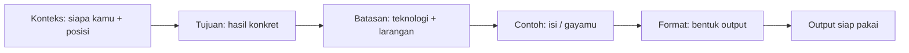
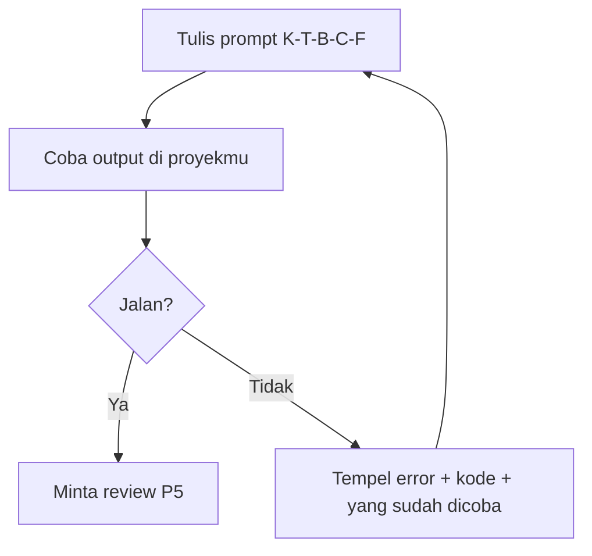

# 04 — Cara Prompting Portfolio: Rumus + Contoh Jelek vs Bagus

> Prompt bagus = **brief ke desainer profesional**. Prompt jelek = "buatkan yang bagus". Hasilnya beda jauh — dan rumusnya bisa dipelajari.

## Rumusnya: K-T-B-C-F



Cara baca diagramnya: lima bahan masuk berurutan, output keluar di kanan. Hilangkan satu bahan = AI menebak-nebak bahan itu (dan tebakannya sering salah).

| Bahan | Tanya ke diri sendiri | Contoh isi |
| ----- | --------------------- | ---------- |
| **Konteks** | Siapa saya? Untuk siapa? | "Pemula TypeScript, portfolio untuk melamar magang frontend" |
| **Tujuan** | Hasil konkret apa? | "Satu halaman: hero + 3 proyek + form kontak Supabase" |
| **Batasan** | Teknologi & larangan? | "TypeScript, static site, Cloudflare Pages, tanpa backend custom" |
| **Contoh** | Ada bahan mentah? | "Nama: ..., proyek: ..., kalimat hero draf: ..." |
| **Format** | Bentuk keluarannya? | "Kode per file + cara deploy 5 langkah + checklist" |

## 3 Pasang Jelek vs Bagus (pelajari polanya!)

### 1. Meminta struktur halaman

❌ **Jelek:**

> "Buatkan portfolio yang bagus."

Kenapa gagal: AI tidak tahu siapa kamu, untuk apa, teknologi apa. Hasilnya generik (nama "John Doe", skill ngarang) dan tidak bisa di-deploy.

✅ **Bagus:**

> "Saya pemula yang belajar TypeScript, mau portfolio satu halaman untuk magang frontend. Buatkan struktur 6 bagian (header, hero, proyek, tentang, kontak, footer). Untuk tiap bagian tulis: tujuannya 1 kalimat + contoh isi memakai data saya berikut: nama ..., 2 proyek (...). Teknologi: TypeScript + static site untuk Cloudflare Pages. Output dalam Bahasa Indonesia."

Kenapa bekerja: ada konteks (pemula, untuk magang), tujuan (6 bagian + isi tiap bagian), batasan (TS, static, Cloudflare), contoh (data asli), format (Bahasa Indonesia, per bagian).

### 2. Meminta form kontak Supabase

❌ **Jelek:**

> "Cara bikin form kontak gimana?"

Kenapa gagal: pertanyaan terlalu lebar — AI menjawab esai umum (PHP? Node? Firebase?) yang tidak nyambung ke arsitektur gratis repo ini.

✅ **Bagus:**

> "Saya punya portfolio static di Cloudflare Pages. Ajari saya menambah form kontak (nama, email, pesan) yang tersimpan ke Supabase. Beri: (1) struktur tabel SQL-nya, (2) kode TypeScript kirim + validasi, (3) cara isi SUPABASE_URL/KEY sebagai environment variable di Cloudflare, (4) 1 jebakan umum pemula. Asumsikan saya belum pernah pakai Supabase."

Kenapa bekerja: batasan arsitektur disebut eksplisit (Pages + Supabase), output dirinci bernomor (AI tidak bisa ngeles), level kejujuran dinyatakan ("belum pernah pakai" → AI menjelaskan langkah dasar, tidak loncat).

### 3. Meminta review / perbaikan

❌ **Jelek:**

> "Tolong cek portfolio saya. [tempel 300 baris kode]"

Kenapa gagal: tanpa kriteria, AI memuji semua ("sudah bagus!") atau mengkritik hal tidak penting (warna) sementara yang fatal (form tidak validasi, kunci API tertulis di kode) lolos.

✅ **Bagus:**

> "Review kode portfolio saya di bawah untuk 4 hal ini saja: (1) apakah hero menjawab siapa/apa dalam 5 detik, (2) apakah responsive di 360px, (3) apakah ada kunci rahasia tertulis di kode, (4) apakah form tervalidasi sebelum dikirim. Untuk tiap temuan: lokasi baris + kenapa masalah + perbaikan konkret. Kode: [...]"

Kenapa bekerja: kriteria sempit = review dalam. Menyebut "kunci rahasia" memaksa AI memeriksa keamanan, bukan cuma estetika.

## 5 Prompt Siap Copy-Paste

**P1 — Draf identitas hero:**

```text
Saya mau kalimat hero portfolio. Data saya: [nama, status: misal mahasiswa/pindah karier, 2 skill utama, 1 bukti: misal "2 proyek latihan online"]. Beri 3 opsi kalimat (maks 20 kata tiap opsi), gaya lugas tanpa kata sifat berlebihan. Lalu rekomendasikan 1 + alasannya.
```

**P2 — Struktur + isi awal:**

```text
Buatkan kerangka portfolio satu halaman (header, hero, proyek, tentang, kontak, footer) untuk [tujuan: magang/freelance]. Tiap bagian: tujuan 1 kalimat + contoh isi dari data saya: [data]. Teknologi TypeScript static site. Bahasa Indonesia.
```

**P3 — Form Supabase dari nol:**

```text
Panduan langkah-demi-langkah: form kontak (nama, email, pesan) dari portfolio static ke Supabase. Sertakan SQL tabel, kode TypeScript validasi + kirim, setting environment variable di Cloudflare Pages, dan cara tes kirim pertama. Saya pemula total di Supabase.
```

**P4 — Anti-spam dasar:**

```text
Form kontak portfolio saya sudah jalan tapi takut spam bot. Jelaskan 3 proteksi termudah untuk static site + Supabase (validasi, honeypot, rate limit): cara kerja tiap-tiapnya 2 kalimat + contoh kodenya. Tanpa layanan berbayar.
```

**P5 — Review sebelum deploy:**

```text
Review portfolio saya sebelum deploy. Cek: (1) hero 5 detik, (2) responsive 360px, (3) tidak ada secret di kode, (4) validasi form, (5) SEO dasar (title, h1, alt gambar). Format: tabel temuan (lokasi | masalah | perbaikan). Kode/file: [...].
```

## Diagram: Siklus Prompting yang Benar



Cara baca diagramnya: prompting itu mengulang, bukan sekali jadi. Kotak E penting: saat error, jangan tanya ulang dari nol — tempel pesan error + kode + apa yang sudah dicoba. Itu bahan bakar AI memberi jawaban tepat.

## Coba Pikirkan

- Ambil satu prompt jelek yang pernah kamu tulis (untuk hal apa pun). Bahan K-T-B-C-F mana yang hilang? Tulis ulang sekarang.
- Kenapa "asumsikan saya pemula total di X" adalah kalimat ajaib? (Jawaban: AI default mengasumsikan kamu menengah — kalimat itu mengkalibrasi level penjelasannya.)

## Prompt yang Bisa Kamu Coba (meta!)

> "Saya belajar prompting. Nilai prompt saya berikut dengan rumus Konteks-Tujuan-Batasan-Contoh-Format: sebutkan bahan yang hilang dan tulis ulang versi bagusnya. Prompt saya: [...]"

## Lanjut ke ...

[05 — Latihan Portfolio](./05-latihan-portfolio.md): 5 level tugas dari teks sampai online.
