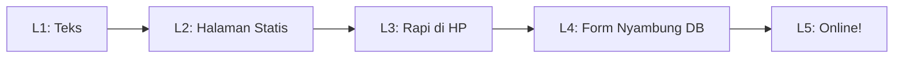
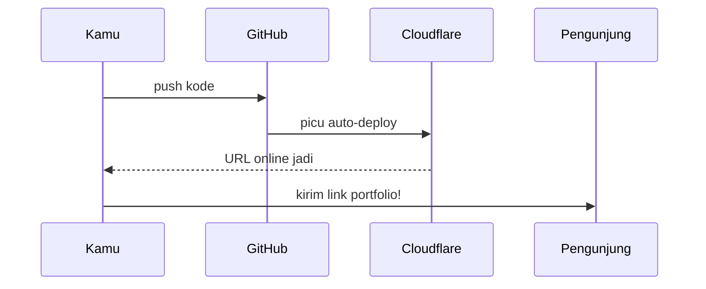

# 05 — Latihan Portfolio: 5 Level dari Teks sampai Online

> Kerjakan berurutan. Tiap level punya **hasil konkret** — jangan naik level sebelum hasilnya jadi. Estimasi total 2–3 jam santai.



Cara baca diagramnya: tiap level fondasi level berikut. L4 (form + database) butuh L2 (halaman) sudah ada. L5 butuh semua sebelumnya.

## Level 1 — Naskah (30 mnt) 📝

**Hasil:** satu file `naskah.md` berisi seluruh teks portfoliomu.

1. Tulis: nama + 1 kalimat identitas + 1 kalimat bukti (pakai prompt P1 dari [modul 04](./04-cara-prompting-portfolio.md)).
2. Tulis 2 draf proyek (judul + masalah yang diselesaikan + apa yang kamu buat). Belum punya proyek? Tulis: "Proyek 1: portfolio ini sendiri", "Proyek 2: form kontak (menyusul level 4)".
3. Tulis 2 paragraf "tentang saya" yang jujur.
4. Minta AI mereview naskahmu dengan prompt: *"Review naskah portfolio saya untuk kejelasan 5 detik, kejujuran skill, dan typo. Naskah: [...]"*.

Naik level kalau: orang lain paham siapa kamu hanya dengan membaca naskah itu.

## Level 2 — Halaman Statis (45 mnt) 🧱

**Hasil:** halaman portfolio tampil di laptopmu (localhost), 6 bagian dari [modul 01](./01-anatomi-portfolio.md).

1. Minta AI buatkan halaman dari naskah L1 (prompt P2 modul 04). Teknologi: TypeScript + static site.
2. Jalankan lokal, cek tiap bagian tampil.
3. Data proyek tulis sebagai array [TypeScript](../Glossary/typescript.md) (contoh di modul 00) — bukan hardcode satu-satu di HTML, biar gampang nambah.

```ts
// Target akhir L2: data rapi seperti ini
type Proyek = { judul: string; deskripsi: string; link?: string };
const daftarProyek: Proyek[] = [
  { judul: "Portfolio ini", deskripsi: "Website pertamaku: ..." },
];
```

Naik level kalau: 6 bagian tampil tanpa error di console browser.

## Level 3 — Rapi di HP + SEO Dasar (30 mnt) 📱

**Hasil:** halaman tetap rapi di lebar 360px + punya title/deskripsi.

1. Kecilkan browser ke ~360px (atau mode HP di DevTools). Perbaiki yang berantakan — kartu [Responsive](../Glossary/responsive.md): menumpuk, bukan menyempit.
2. Tambah: `<title>` jelas, 1 `<h1>`, `meta description`, teks alt di tiap gambar ([SEO](../Glossary/seo.md) dasar).
3. Minta review P5 modul 04 (poin 1, 2, 5 saja).

Naik level kalau: bisa di-scroll nyaman di HP tanpa geser kiri-kanan.

## Level 4 — Form Nyambung Database (45 mnt) 💾

**Hasil:** pesan dari form kontak beneran tersimpan di [Supabase](../Glossary/supabase.md) dan bisa kamu lihat di dashboard.

1. Buat proyek + tabel `pesan` di Supabase (dipandu prompt P3 modul 04).
2. Sambungkan form: validasi dulu ([Form](../Glossary/form.md)), baru kirim via [API](../Glossary/api.md). Ikuti diagram sequence di [modul 03](./03-arsitektur-portfolio.md).
3. Tes 3x: (a) kirim valid → sukses, (b) email ngawur → ditolak baik-baik, (c) pesan kosong → ditolak.
4. Kunci API via [Environment Variable](../Glossary/environment-variable.md) — pastikan tidak tertulis di kode (cek P5 modul 04 poin 3).
5. Tambah 1 proteksi [Spam](../Glossary/spam.md) (prompt P4 modul 04).

Naik level kalau: 3 skenario tes di atas berperilaku benar + pesan terlihat di dashboard Supabase.

## Level 5 — Online (30 mnt) 🚀

**Hasil:** portfolio bisa dibuka orang lewat URL publik.

1. Push kode ke [Repo](../Glossary/repo.md) GitHub ([Git](../Glossary/git.md): add → commit → push).
2. Hubungkan repo ke Cloudflare Pages → auto-[Deploy](../Glossary/deploy.md). Isi environment variable Supabase di dashboard Pages.
3. Buka URL publik. Ulangi tes L4 (kirim pesan beneran) di URL publik — bukan cuma di localhost!
4. Jalankan [checklist modul 06](./06-checklist-portfolio.md). Lolos semua = selesai.



Cara baca diagramnya: kamu hanya push sekali; GitHub dan Cloudflare yang meneruskan estafet sampai ke pengunjung.

## Kalau Stuck

1. Baca pesan error-nya (jangan panik, 80% jawabannya ada di situ).
2. Tempel ke AI dengan pola: *"Saya level X, sedang [tujuan]. Error: [pesan error]. Kode: [potongan]. Sudah saya coba: [usaha]."* (pola kotak E di diagram modul 04).
3. Stuck >30 menit di satu titik? Lewati dengan versi sederhana dulu, tandai, lanjut. Portfolio jelek yang online > portfolio sempurna yang tidak jadi-jadi.

## Coba Pikirkan

- Level mana yang paling kamu takuti? Biasanya L4 — dan itu kabar baik, karena modul 03 + prompt P3 memang disiapkan untuk itu.
- Siapa orang pertama yang akan kamu kirimi link portfolio? Tulis namanya. Target konkret bikin latihan selesai.

## Lanjut ke ...

[06 — Checklist Siap Online](./06-checklist-portfolio.md): verifikasi terakhir sebelum kirim link ke siapa pun.
