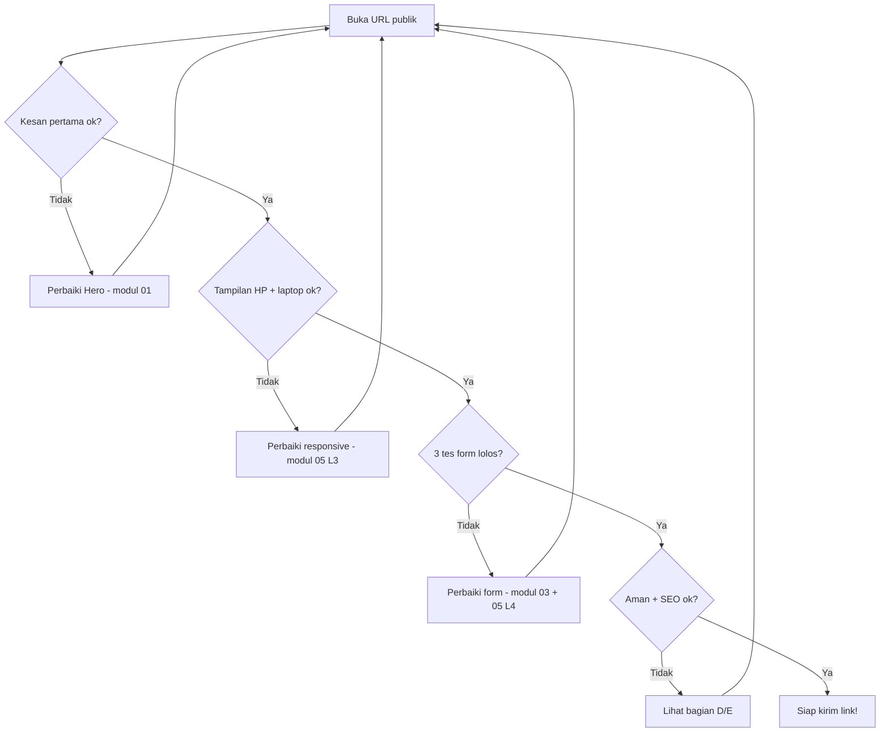

# 06 — Checklist Siap Online ✅

> Jangan kirim link ke siapa pun sebelum semua kotak di bawah centang. Checklist ini menangkap 90% malu-maluin portfolio pemula.

## Cara Pakai

Buka URL publikmu (bukan localhost!) dan centang satu per satu. Kalau ada yang gagal, balik ke modul yang dirujuk, perbaiki, [Deploy](../Glossary/deploy.md) ulang, cek lagi.

## A. Kesan Pertama (5 Detik)

- [ ] Dalam 5 detik jelas: siapa kamu + bisa apa (rujuk [modul 01](./01-anatomi-portfolio.md) bagian Hero).
- [ ] Ada 1 tombol aksi yang terlihat tanpa scroll ("Lihat Proyek" / "Hubungi Saya").
- [ ] Tidak ada teks contoh tertinggal ("Lorem ipsum", "John Doe", "namamu").

## B. Tampilan

- [ ] Rapi di HP 360px: tidak ada scroll kiri-kanan ([Responsive](../Glossary/responsive.md)).
- [ ] Rapi di laptop 1280px: tidak ada bagian kosong melompong.
- [ ] Semua gambar tampil (tidak ada ikon gambar rusak) + punya teks alt.
- [ ] Tidak ada error di console browser (klik kanan → Inspect → Console).

## C. Form Kontak (uji beneran!)

- [ ] Kirim pesan valid → muncul "terkirim" + pesan **terlihat di dashboard [Supabase](../Glossary/supabase.md)**.
- [ ] Email ngawur (`bukan-email`) → ditolak dengan pesan baik-baik, tidak terkirim.
- [ ] Pesan kosong → ditolak.
- [ ] Minimal 1 proteksi [Spam](../Glossary/spam.md) aktif (lihat [modul 03](./03-arsitektur-portfolio.md)).



Cara baca diagramnya: alur pemeriksaan berurutan. Setiap "Tidak" memutar balik ke perbaikan lalu cek ulang dari atas — jangan lompat, karena perbaikan kadang merusak yang sudah ok.

## D. Keamanan

- [ ] Tidak ada kunci/API key tertulis di kode (cari `eyJ`, `sk-`, `key = "` di repo — harus nihil). Kunci hanya di [Environment Variable](../Glossary/environment-variable.md).
- [ ] URL memakai `https://` (gembok di browser, [HTTPS](../Glossary/https.md)).
- [ ] Tabel Supabase tidak bisa ditulis anonim sembarangan (ada validasi + proteksi spam).

## E. SEO + Rapi-rapi

- [ ] `<title>` unik: "Portfolio [Namamu] — ..." (bukan "Untitled").
- [ ] Ada 1 `<h1>` + `meta description` ([SEO](../Glossary/seo.md)).
- [ ] Link demo/kode tiap proyek diklik dan **tidak 404**.
- [ ] Footer ada (© + tahun + nama).

## F. Bukti Selesai

- [ ] Kode ter-push ke [Repo](../Glossary/repo.md) GitHub, commit terakhir = versi yang online.
- [ ] Kirim link ke 1 orang + minta 1 kalimat kesan pertama mereka. Catat jawabannya — itu bahan iterasi berikutnya.

## Contoh TypeScript: Cek Secret Bocor (Jalankan di Repo)

```ts
// Pola yang TIDAK BOLEH ketemu di kode (cari manual dengan Ctrl+Shift+F):
//   SUPABASE_KEY = "eyJ..."   <- salah! kunci tertulis di kode
//   const key = "sk-..."       <- salah!
// Yang benar selalu: process.env.SUPABASE_KEY (dibaca dari server)
```

## Coba Pikirkan

- Poin mana yang paling sering gagal di percobaan pertama? (Pengalaman umum: C — form dites di localhost tapi lupa dites di URL publik dengan environment variable yang belum diisi di dashboard Cloudflare.)
- Kesan 1 kalimat dari temanmu tadi: bagian portfolio mana yang akan kamu perbaiki duluan minggu depan?

## Prompt yang Bisa Kamu Coba

> "Saya baru menyelesaikan checklist portfolio: [paste yang gagal]. Bantu saya debug poin [...] dengan langkah cek berurutan dari yang paling mungkin."

## Lanjut ke ...

Topik berikutnya: buat folder baru (misal `Blog/`) — agent akan mengisinya otomatis mengikuti pola repo ini (lihat [AGENTS.md](../AGENTS.md)). Selamat, portfolio pertamamu online! 🎉
