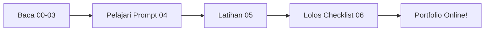

# Portfolio — Materi Pertama: Bikin Rumah Contohmu di Internet

> Portfolio = **rumah contoh** yang membuktikan kamu bisa bikin web. Modul ini membawamu dari nol sampai online, gratis.

## Untuk Siapa?

Kamu yang **belum tahu apa-apa** tentang development tapi mau mulai dengan benar: paham istilahnya, bisa prompting dengan baik, dan punya satu website online sebagai bukti.

## Yang Akan Kamu Bisa

Selesai modul ini, kamu bisa menjelaskan dan membuat:

1. Apa itu portfolio dan kenapa perekrut memintanya.
2. Bagian-bagian halaman portfolio (header, hero, proyek, kontak).
3. Arti istilah teknisnya ([Frontend](../Glossary/frontend.md), [Backend](../Glossary/backend.md), [Database](../Glossary/database.md), [API](../Glossary/api.md), dst).
4. Arsitektur gratis: [Cloudflare](../Glossary/cloudflare.md) + [Supabase](../Glossary/supabase.md).
5. Prompt yang bagus untuk membangun portfolio dibantu AI.
6. Satu portfolio online dengan form kontak yang tersimpan beneran.

## Peta Belajar (urut!)

| No | Modul | Isi | Waktu |
| -- | ----- | --- | ----- |
| 0 | [Apa itu Portfolio?](./00-apa-itu-portfolio.md) | Konsep + analogi rumah contoh | 15 mnt |
| 1 | [Anatomi Portfolio](./01-anatomi-portfolio.md) | Bagian-bagian halaman + diagram | 30 mnt |
| 2 | [Istilah Teknis Portfolio](./02-istilah-teknis-portfolio.md) | Kamus mini + link Glossary | 30 mnt |
| 3 | [Arsitektur Gratis](./03-arsitektur-portfolio.md) | Cloudflare + Supabase + diagram | 30 mnt |
| 4 | [Cara Prompting Portfolio](./04-cara-prompting-portfolio.md) | Rumus + jelek vs bagus | 30 mnt |
| 5 | [Latihan](./05-latihan-portfolio.md) | Tugas bertahap 1–5 | 2–3 jam |
| 6 | [Checklist Siap Online](./06-checklist-portfolio.md) | Cek sebelum publish | 15 mnt |

Total: ± 5 jam belajar + praktik santai.

## Cara Pakai Bersama AI

1. Baca modul 00–03 berurutan (jangan loncat, istilahnya nyambung).
2. Di modul 04, copy prompt siap pakainya, tempel ke AI favoritmu.
3. Kerjakan latihan modul 05 — tiap selesai satu level, minta AI mereview dengan prompt dari modul 04.
4. Lolos checklist modul 06 → [Deploy](../Glossary/deploy.md). Rayakan. 🎉

## Prasyarat

Tidak ada. Akun gratis Cloudflare + Supabase + GitHub dibuat saat latihan (dipandu). Laptop + browser cukup.

Cara baca diagramnya: ikuti panah kiri ke kanan. Jangan deploy sebelum checklist lolos — itu gunanya D sebelum E.
