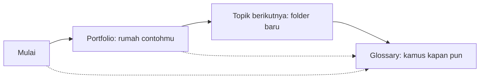

# Materi Developer — Dari Nol sampai Paham Istilah & Prompting

> Repo belajar untuk orang dengan **minimal knowledge tentang development**. Bahasa contoh: [TypeScript](./Glossary/typescript.md). Arsitektur: [Cloudflare](./Glossary/cloudflare.md) + [Supabase](./Glossary/supabase.md) free tier.

## Mulai dari Sini

Cara baca diagramnya: alur utama kiri ke kanan mulai dari Portfolio. Garis putus-putus ke Glossary artinya "mampir kapan pun ketemu istilah asing".

## Daftar Topik

| Topik | Isi | Status |
| ----- | --- | ------ |
| [Portfolio](./Portfolio/README.md) | Website pertama: konsep → anatomi → arsitektur gratis → prompting → latihan → online | ✅ Siap dipelajari |
| [Glossary](./Glossary/README.md) | 24 istilah: frontend sampai spam, analogi + contoh TypeScript | ✅ Dipakai semua materi |

## Cara Belajar yang Disarankan

1. Masuk [Portfolio](./Portfolio/README.md), ikuti modul 00→06 berurutan.
2. Tiap ketemu istilah ber-link, klik — itu pintu ke [Glossary](./Glossary/README.md).
3. Praktik dengan AI memakai prompt dari modul 04 tiap topik.
4. Selesai satu topik = satu hasil online. Kumpulkan buktinya.

## Buat Topik Baru? Tinggal Buat Folder!

Agent otomatis mengisi folder kosong mengikuti aturan [AGENTS.md](./AGENTS.md): materi Markdown + diagram Mermaid + link Glossary. Kamu cukup:

1. Buat folder, misal `Blog/`.
2. Agent mengisinya (README + modul 00–06 + glossary baru bila perlu).
3. Kamu belajar seperti biasa.

## Aturan Main Repo

- Contoh kode: TypeScript saja (SQL kecil untuk Supabase boleh).
- Semua harus bisa dipraktikkan gratis (Cloudflare + Supabase free tier).
- Satu istilah asing = langsung dijelaskan + link Glossary.
- Visual = diagram Mermaid (render otomatis di GitHub).
